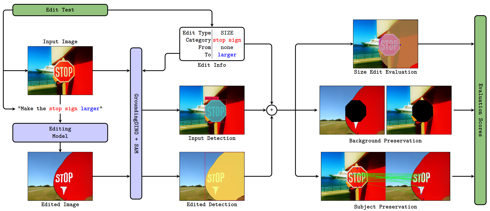

# PixLens 🔍 — A Benchmarking Pipeline for Prompt-Guided Image Editing  
[](https://arxiv.org/abs/2410.05710)

Evaluate & understand the behavior of prompt-based image editing models — down to each pixel and object 🎯.

---


## 🖼️ Overview

PixLens is a comprehensive evaluation framework for **prompt-based image editing models**. It allows fine-grained analysis of edit success and consistency by breaking down the edited scene into **subject**, **background**, and **edit-specific effects**.

<p align="center">
  
</p>


> **Fig. 1**: PixLens Edit Evaluation Pipeline. Example for the `SIZE` operation (`"Make the stop sign larger"`).

---

## ⚙️ Installation

Set up the environment (Python 3.11) with the following steps:

```shell
# Clone the repository
git clone https://github.com/thesstefan/pixlens && cd pixlens

# Download sample EditVal images
wget --no-check-certificate -r "https://drive.google.com/uc?export=download&id=1q_V2oxtGUCPE2vkQi88NvnGurg2Swf9N" -O editval_instances.zip
unzip editval_instances.zip && rm editval_instances.zip

# Create and activate conda environment
conda create -n $ENVNAME "python>=3.11" --file requirements.txt -c pytorch -c nvidia -c conda-forge
conda activate $ENVNAME

# Install dev packages if needed
conda install --name $ENVNAME --freeze-installed --file requirements-dev.txt

# Install xformers==0.0.23.post1
# No available conda package [issue](https://github.com/facebookresearch/xformers/issues/749)
pip install xformers==0.0.23.post1

# Install Image Reward
pip install image-reward

# With the usage of vqgan+clip, one has to follow the instructions in the repo we are based on (https://github.com/nerdyrodent/VQGAN-CLIP), but essentially one can download:
pip install kornia==0.7.2 taming-transformers git+https://github.com/openai/CLIP.git

# ⚠️ When doing so, required manual fix for taming-transformers
# Change 'pytorch_lightning.utilities.distributed' to 'rank_zero' in taming/main.py as indicated in the [issue](https://github.com/AUTOMATIC1111/stable-diffusion-webui/issues/11458#issuecomment-1609900319)

# Install PixLens in editable mode
pip install --no-build-isolation --no-deps -e .
```

📦 Alternatively, download EditVal instances manually [here](https://drive.google.com/uc?export=download&id=1q_V2oxtGUCPE2vkQi88NvnGurg2Swf9N).

---

## ⚠️ Notices & Fixes

> 💡 **NOTICE 1**: The NullTextInversion model is available only when `diffusers=10.0.0` due to 
> issues when using newer versions ([#1](https://github.com/google/prompt-to-prompt/issues/57), 
> [#2](https://github.com/google/prompt-to-prompt/issues/72), [#3](https://github.com/google/prompt-to-prompt/issues/37)).
> Therefore, use the [`requirements-null-text-inv.txt`](https://github.com/thesstefan/pixlens/blob/main/requirements-null-text-inv.txt) 
> dependencies instead when dealing with NullTextInversion.
>
> 🛠️ **NOTICE 2**: On some bare-bones systems (like containers), it may be required to provide the `libgl1.so` dependency for OpenCV. The
> following error is raised be `pixlens` if the dependency is not available:
>```python
> ImportError: libGL.so.1: cannot open shared object file: No such file or directory
>```
> On Debian-based systems this can be installed by running
>```
> apt-get install libgl1
>```

---

## 📊 Evaluation Pipeline

Available **editing models**:
- InstructPix2Pix
- ControlNet
- LCM
- VQGAN+CLIP
- OpenEdit
- NullTextInversion (optional)
- DiffEdit (optional)

Due to some issues, DiffEdit and NullTextInversion are left out the full benchmark by default. 

Available **detection & segmentation models**:
- GroundedSAM (GroundingDINO + SAM)
- OwlViT-SAM (OwlViT + SAM)

All models can be loaded by specifying their corresponding YAML configurations 
from [`model_cfgs`](https://github.com/thesstefan/pixlens/tree/main/model_cfgs).

Supported **edit operations**:
- `object_addition`
- `object_removal`
- `object_replacement`
- `alter_parts`
- `move_object`
- `positional_addition`
- `size`
- `color`

Additionally, PixLens evaluates **subject** and **background** preservation per edit.

Generally, you can expect to find some artifacts (edited images, segmentation results, explanatory visualization, scores) 
in PixLens's cache directory (`~/.cache/pixlens` on UNIX, `C:\Users\{USER}\AppData\Local\pixlens\pixlens/Cache` on Windows).

### 🧠 Caching Models
For models like `VQGAN+CLIP` or [`OpenEdit`](https://github.com/xh-liu/Open-Edit), place downloaded checkpoints in:

```
~/.cache/pixlens/models--VqGANClip/checkpoints
~/.cache/pixlens/models--openedit/vocab
~/.cache/pixlens/models--openedit/checkpoints
```
<!-- 
If the model VQGAN+CLIP is used, please download their checkpoints folder and place it in the PixLens's cache directory under the folder models--VqGANClip (in the end the folder Cache/models--VqGANClip/checkpoints should be there)-

If the model OpenEdit is used, also download their checkpoints and vocab folders, as indicated in the [repo](https://github.com/xh-liu/Open-Edit) and again place them under the folder models--openedit (in the end the folder Cache/models--openedit/vocab and .../checkpoints should be there). -->

---

## 🚀 Running PixLens

### 🧪 Full Evaluation Pipeline

To run the whole evaluation pipeline (for InstructPix2Pix, ControlNet, LCM, OpenEdit and VQGAN+clip), run:

```shell
pixlens-eval --detection-model-yaml ${DETECTION_MODEL_YAML} --run-evaluation-pipeline
```

### 🔧 Specific Evaluation (custom model + edit)

To run a more specific evaluation (for one specific model & operation type), run:

```shell
pixlens-eval --detection-model-yaml ${DETECTION_MODEL_YAML} 
             --editing-model-yaml ${EDITING_MODEL_YAML}
             --edit-type ${EDIT_TYPE}
             --do-all
```

🗂️ Results will be saved to:
- `~/.cache/pixlens/evaluation_results.json` (aggregated)
- `evaluation_results.csv` (per-edit)

>Currently, here are the possible parameterizations:
>- `EDITING_MODEL_YAML` values: 
>[`model_cfgs/lcm.yaml`](https://github.com/thesstefan/pixlens/blob/main/model_cfgs/lcm.yaml),
>[`model_cfgs/instruct_pix2pix.yaml`](https://github.com/thesstefan/pixlens/blob/main/model_cfgs/instruct_pix2pix.yaml),
>[`model_cfgs/controlnet.yaml`](https://github.com/thesstefan/pixlens/blob/main/model_cfgs/controlnet.yaml),
>[`model_cfgs/null_text_inversion.yaml`](https://github.com/thesstefan/pixlens/blob/main/model_cfgs/null_text_inversion.yaml),
>[`model_cfgs/diffedit.yaml`](https://github.com/thesstefan/pixlens/blob/main/model_cfgs/diffedit.yaml),
>- `DETECTION_MODEL_YAML` values: [`model_cfgs/grounded_sam.yaml`](https://github.com/thesstefan/pixlens/blob/main/model_cfgs/grounded_sam.yaml)
>[`model_cfgs/owlvit_sam.yaml`](https://github.com/thesstefan/pixlens/blob/main/model_cfgs/owlvit_sam.yaml)
>- `EDIT_TYPE` values: `object_addition`, `object_replacement`, `object_removal`, `alter_parts`, 
>`position_replacement`, `positional_addition`, `size`, `color`

Similarly, there are other CLI scripts provided for debugging intermediary steps, like [`pixlens_editing`](https://github.com/thesstefan/pixlens/blob/main/pixlens/cli/pixlens_editing_cli.py),
[`pixlens_detection`](https://github.com/thesstefan/pixlens/blob/main/pixlens/cli/pixlens_detection_cli.py), or [`pixlens_caption`](https://github.com/thesstefan/pixlens/blob/main/pixlens/cli/pixlens_caption_cli.py).

## 🔍 Disentanglement Pipeline

To execute the disentanglement pipeline, use the following command:

```shell
pixlens-disentanglement --model-params-yaml ${MODEL_PARAMS_YAML}
```
Outputs will be saved under:
```
~/.cache/pixlens/models--<your_model>/disentanglement/
```

This folder contains critical outputs of the evaluation, including:

- `results.json`: A file that details the most significant findings of the evaluation.

- **Confusion Matrix Plot** 📉: A visual representation to help understand the performance of the model.

> In case you prefer not to rerun the entire process, you have the option to delete the `.pkl` files. These files store essential data required for the evaluation.


---

## 🧩 Benchmark Your Own Model

To add your custom model:
1. Implement a class following [`PromptableImageEditingModel`](https://github.com/thesstefan/pixlens/blob/main/pixlens/editing/interfaces.py#L16)
2. Add it under [`pixlens/editing`](https://github.com/thesstefan/pixlens/tree/main/pixlens/editing)
3. Create a YAML file like the ones in [`model_cfgs`](https://github.com/thesstefan/pixlens/tree/main/model_cfgs) and use this file as the parameter for the `--editing_model_yaml` flag of `pixlens-eval` and `pixlens-disentanglement`.

---

## 🙏 Acknowledgements

PixLens builds on top of [EditVal](https://github.com/deep-ml-research/editval_code), and incorporates work from:

- [Prompt-to-Prompt / NullTextInversion](https://github.com/google/prompt-to-prompt)
- [GroundingDINO](https://arxiv.org/abs/2303.05499)
- [OwlViT](https://arxiv.org/abs/2205.06230)
- [SAM](https://arxiv.org/abs/2304.02643)
- [InstructPix2Pix](https://arxiv.org/abs/2211.09800)
- [LCM](https://arxiv.org/abs/2310.04378)
- [ControlNet](https://arxiv.org/abs/2302.05543)
- [DiffEdit](https://arxiv.org/abs/2210.11427)

---

📫 Feedback, issues, or improvements? Feel free to open an [Issue](https://github.com/thesstefan/pixlens/issues) or a Pull Request!

---